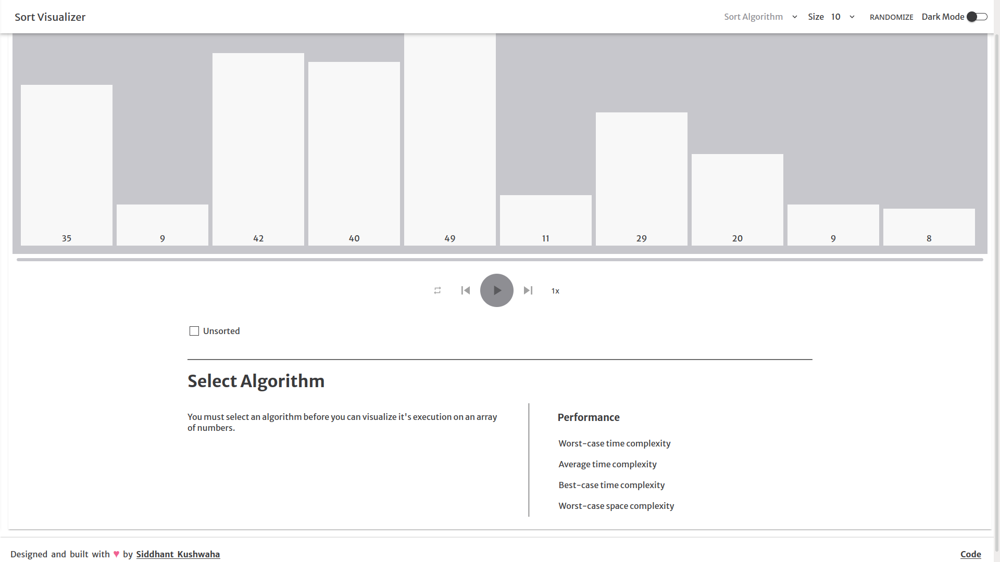
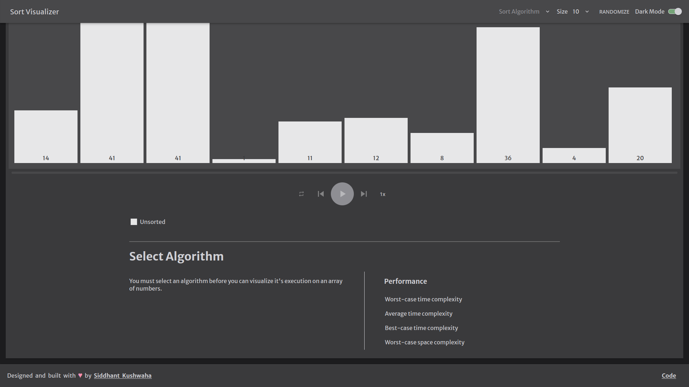

# Sort Visualizer

This is a progressive web app built using React and is used to visualize classic sorting algorithms such as insertion sort, merge sort, quick sort, heap sort, etc.

## Installation

The app is already deployed so you can play around with the final product using this [link](https://github.com/siddhantkushwaha-star/sorting_visualizer.git).

If you wish to run this app locally, clone this repo and install the dependencies.

```
$ git clone https://github.com/siddhantkushwaha-star/sorting_visualizer.git
$ cd sorting_visualizer
$ npm install
$ npm audit fix 
```

## App Design

The app is responsive, meaning it works across a variety of screen sizes and dimensions.



The app has a switch for turning on dark mode.




